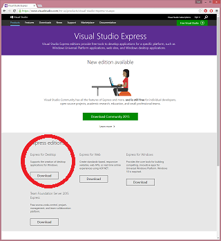
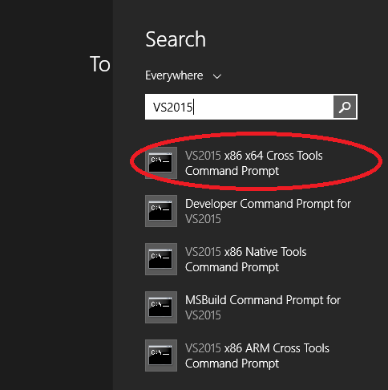

Hello World C Extension
-----------------------

An example C extension module for Python 3.5, and how to build it on Windows.

1. Install Python 3.5 x86-64
----------------------------

https://www.python.org/downloads/release/python

2. Install Visual Studio 2015
-----------------------------

https://www.visualstudio.com/en-us/products/visual-studio-express-vs.aspx

I picked this one:

3. Open the "VS2015 x86 x64 Cross Tools Command Prompt"
-----------------------------

Not the "Native Tools Command Prompt"

Not the "Developer Command Prompt"

4. Build It
-----------

`python setup.py install`

5. Run It
---------

`python -m pytest test.py`
